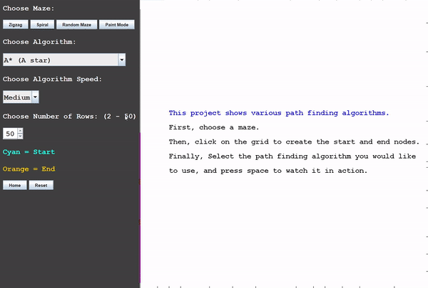
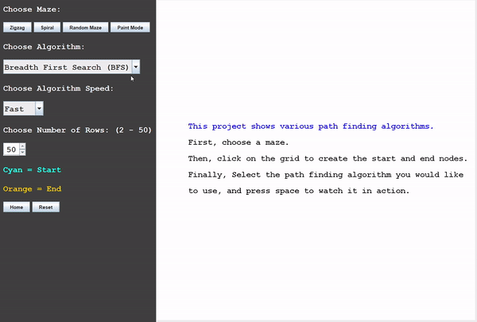

# PathFinder
Visualization of common pathfinding algortihms

## Running an algorithm
Choose between the different available mazes (Zigag, Spiral or Random Maze). Use the left mouse button to create the start (Blue) and end (Orange) nodes, choose the algorithm you would like to visualize and the algorithm speed and then press the spacebar to watch it in action. You can also click the reset button to quickly clear the maze, saving only the start and end nodes.

## Paint Mode
This mode allows you to draw your own maze by adding and deleting barriers (Black) on the screen using the left and right mouse buttons respectively. Pressing the reset button in this mode clears the maze saving the start and end nodes, as well as the barriers.

## The Algorithms
[Breadth First Search (BFS)](https://www.geeksforgeeks.org/breadth-first-search-or-bfs-for-a-graph/)  
[Depth First Search (DFS)](https://www.geeksforgeeks.org/depth-first-search-or-dfs-for-a-graph/)  
[Dijkstra](https://www.geeksforgeeks.org/dijkstras-shortest-path-algorithm-greedy-algo-7/)  
[A* (A Star)](https://www.geeksforgeeks.org/a-search-algorithm/)

